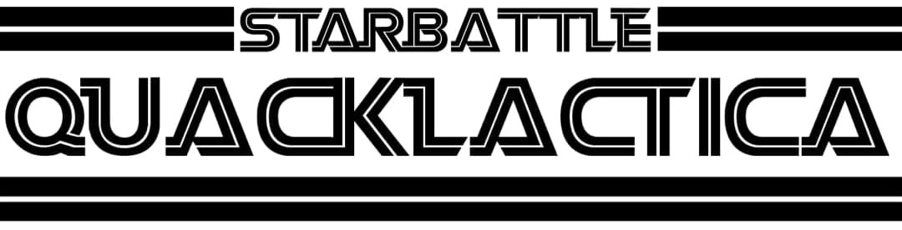

Having a README in your team's repository facilitates judging. A good README contains:
* a clear title for your project,
* a short abstract,
* the motivation/goals for your project,
* a description of the work you did, and
* proposals for future work.

# Starbattle Quacklactica

#### *Creating and Solving Star Battle Games with Quantum Annealing* 

Diogo Cruz, Duarte Magano, Óscar Amaro, Sagar Pratapsi

---

Quantum annealing is a computing paradigm that has the ambitious goal of efficiently solving large-scale combinatorial optimization problems of practical importance [1,2].

In this work, we present **both a generator and a solver of Star Battle games, using a quantum annealing device from D-Wave**. A presentation of the method can be seen .

## Introduction

Quantum annealing has been designed to solve classical combinatorial optimization problems, with applications ranging from computer science problems, classification, quantum chemistry, machine learning, search engine ranking to protein folding. Such optimization problems require the minimization of acost function, a task that can be rephrased as finding the ground state of a classicalIsing Hamiltonian . Many problems of practical importance, however, have costfunctions with a large number of local minima, corresponding to Ising Hamiltonians that are reminiscent of classical spin glasses. These characteristics make it extremely difficult for classical algorithms to find the global minimum.

## How to Play

Fill cells with ~~stars~~ ducks so that:

* each row, column, and bold region contains the indicated number of ducks.
* ducks are not placed in adjacent cells that share an edge or corner.

### Starting options:

How can choose the grid size and the number of ducks per row/column/region.

### Menu options:

You can choose to generate a new grid using a classical method, a quantum-inspired method, or using a real quantum device from D-Wave. You can also look at the solution given by a classical method, a quantum-inspired method, or using a real quantum device from D-Wave.

As is traditional, you can exit the game, once you are tired of ducks.

#### Generating games

The quantum generator first produces a game without regions, with a distribution of stars that satisfies the games rules, by implementing a Binary Quadratic Model in a D-Wave quantum device. A subsequent Binary Quadratic Model (BQM) is used to draw the regions in the game, while ensuring that the games rules are satisfied.

The quantum-inspired generator uses the same principles as the quantum one, but it is run on a quantum annealing simulator, and not a real quantum device.

For the classical generator, the star positions and regions are random generated while taking into account some of the games rules. These games are generated until all the rules of the game are satisfied, thereby ensuring that the game grid is valid, and that there is a solution. As expected, this generator takes a long time to succeed, for bigger grids.

#### Solving games

The quantum solver uses a Binary Quadratic Model to search for a star distribution on the game's grid that satisfies all the games rules. It does so by running on a real D-Wave quantum device.

The quantum-inspired solver uses the same principles as the quantum one, but it is run on a quantum annealing simulator, and not a real quantum device.

The classical simulator uses a previously-implemented approach [3] to find a solution. It is present mainly as a debug tool.

## Future work

There were several things we didn't have time to implement:
* Helper based on quantum annealing: as the player places their ducks, the game could solve a BQM problem in the background to check if the move leads to a valid solution.
* Star Battle variants: Add other variants of the game, with slightly different rules.
* More player control: Allow the player to use the GUI to change the parameters associated with the different generator and solver methods (for instance, the number of samples obtained from the D-Wave device).
* Prettier GUI.

## References

[1]Lucas, A. "Ising formulations of many NP problems." Front. Physics 2, (2014).

[2]Hauke, P., Katzgraber, H. G., Lechner, W., Nishimori, H. & Oliver, W. D. "Perspectives of quantum annealing: Methods and implementations." Rep. Prog. Phys. 83, 054401 (2020).

[3][Yadkee]. (2018, February 16). [2018-02-16] Challenge #351 [Hard] Star Battle solver [Online forum post]. Retrieved from https://www.reddit.com/r/dailyprogrammer/comments/7xyi2w/20180216_challenge_351_hard_star_battle_solver/

<!-- ## ToDo:
### Things we would wanna fix/implement but didn't have enough time to do

* Graphics
* More than 2 player support
* Better quantum circuit visualization
* Option to pick between real and simulated quantum simulation as opposed ot editing the source code
* Adding more gates and game mechanics to make it more fun

## Highlights:

*   In our game, the result is quantum. No one knows the results until the measurement.
*    Player can increase their probability of winning, but nothing is guaranteed.
*   During the game, two players are building a quantum circuit together. They try interfering with the result of the entangled qubits to something they desire.
*   In the game, we applied Quantum Random Number Generator to find the type and place of gates. The speeds of Quhacmans change with entangled two qubits circuit.
*   The rule and strategy are quantum. We use Bloch sphere as a win indicator. -->
