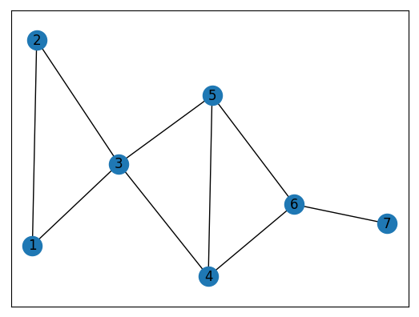
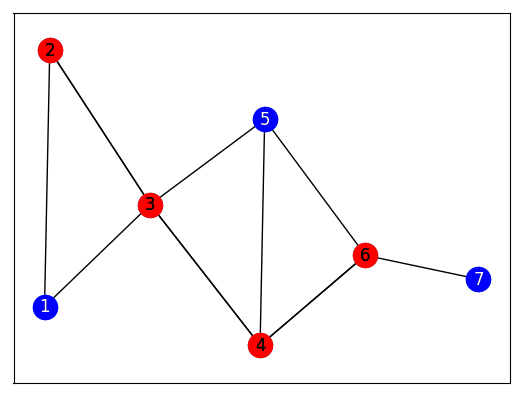

[](
  https://circleci.com/gh/dwave-examples/pipelines)

# Pipelines

Pipeline networks can be viewed as a graph built up of edges (pipeline
segments) and nodes (junctions of pipeline segments).  Suppose that within this
network of pipelines, we want to determine a set of junctions from which we can
monitor every pipeline segment.  This problem can be modeled as a vertex cover
problem in which we want to find a subset of nodes in a graph such that every
edge has at least one end point in our subset.

Let's look at a simple example.  Below we have a graph representing a simple
network of pipelines with seven junctions.  Note that each junction is
identical in terms of its utility as a monitoring location.



Problem: Given the above set of junctions, which ones should you choose such
that you minimize the number selected for monitoring, while still monitoring
every segment?

Solution: One possible solution is indicated by the red nodes below.



## Usage

To run the demo:

```bash
python pipelines.py
```

## Code Overview

The program `pipelines.py` creates a graph using the Python package
`networkx`, and then uses the Ocean software tools to run the
`minimum_vertex_cover` function from within the `dwave_networkx` package.

A valid vertex cover is a subset of nodes in the graph such that every edge in
the graph has at least one end point in the subset. Visual inspection shows
that we will need either 1 or 2 in the solution; we will also need 6 or 7; and
we will also need 4 or 5. We therefore know that a minimum vertex cover will
have at least 3 nodes; it turns out that there must be four.

Gamma, our Lagrange parameter (see [Lagrange
Multiplier](https://en.wikipedia.org/wiki/Lagrange_multiplier) for a discussion
of Lagrange multiplier, an analogous concept), weights the constraints in the
problem versus the energy term (objective). If the Lagrange parameter is too
small relative to the strength of the energy term, the constraints may be
violated.

With a Lagrange parameter that is too weak, the solutions are sets which are
too small. In the `minimum_vertex_cover` function from within the
`dwave_networkx` package, the default of the Lagrange parameter is 2.
Repeated runs, using the default, produced sets which had size 2 or 3.

Hence, the Lagrange parameter value of 5 was set large enough to (1) balance the
energy term and constraints, and to (2) cause the minimum vertex cover
conditions to all be satisfied for this problem.

## License

Released under the Apache License 2.0. See [LICENSE](LICENSE) file.
